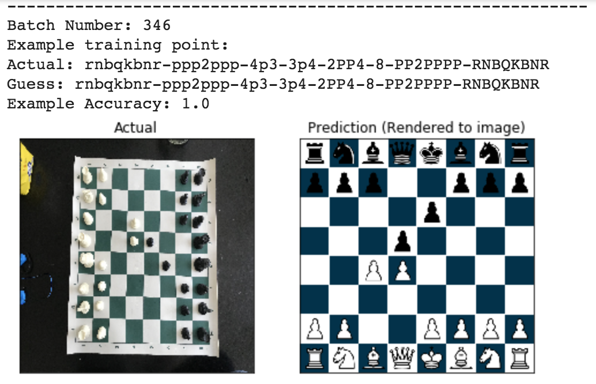
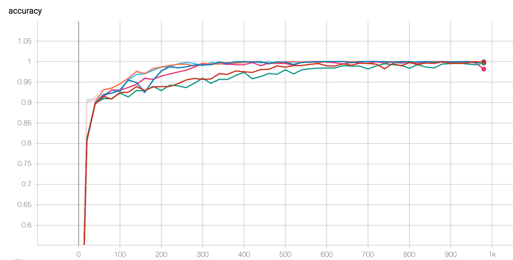
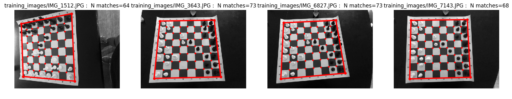

# CIS 520 Final Project
Michael Deng (michdeng@wharton)  
Samuel Ryan (samryan@seas)  
Mukund Venkateswaran (mukundv@seas)  
Kurt Convey (kconvey@seas)  


## How to Use
#### To run on the easy dataset: 

1. Upload the most up to date easy dataset notebook from `clean_notebooks/` into [Google Colab](https://colab.research.google.com "Google Colab") and run all cells.

#### To run on a real dataset: 
1. Follow instructions below to preprocess labeled images
2. Upload the most up to real dataset notebook date notebook from `clean_notebooks/` into [Google Colab](https://colab.research.google.com "Google Colab") and update path to the preprocessed dataset.


#### To Preprocess Images for a Real Dataset : 
1. Figure out where the images are stored and where to put the preprocessed images.

```
$ git clone https://github.com/samryan18/chess-ray-vision.git
$ cd chess-ray-vision
$ pip install -e .
$ preprocess [OPTIONS] # or run with no options to be prompted for inputs

# Example run with inputs
$ preprocess --verbose --glob_path="real_images_tr/labeled/*.jpeg" --dest_path="warped_training_images"
$ preprocess --verbose --glob_path="path_to_images/*.jpeg" --dest_path="./preprocessed"
```
##### Options

###### Glob Path [--glob_path]
* Include `--glob_path="path_to_directory/*.jpeg"` to specify where the images to preprocess are stored and what the file format is
* Prompted for if not included

###### Destination Path [--dest_path]
* Include `--dest_path="path_to_destination_directory"` to specify where to put preprocessed images
* Prompted for if not included

###### Verbose [--verbose]
* Flag for whether to print info about the run
* Include `--verbose` to run in this mode

###### Help [--help]
* Run `$ preprocess --help` for help.


## First Perfect Classification!
Queen's Gambit :)


## Initial Results on Easier Dataset

#### Learning curves for a few different CNN models:
(implemented in PyTorch)



#### Some examples of output during training:
The predictions get better as we progress through mini-batches.


## Initial Preprocessing Results
Preprocessing code adapted from [here](https://github.com/Elucidation/ChessboardDetect/blob/master/FindChessboards.py
 ""). (Thanks to @[Elucidation](https://github.com/Elucidation ""))


#### How Preprocessing Works:
1. Convert image to binary bitmap
2. Blur the image
3. [Sobol Filter](https://en.wikipedia.org/wiki/Sobel_operator)
4. [Canny Edge Detectors](https://en.wikipedia.org/wiki/Canny_edge_detector#Gaussian_filter)
5. [Finding Contours](https://docs.opencv.org/3.1.0/d4/d73/tutorial_py_contours_begin.html) with `cv2`
6. "Prune the contours"—[Ramer–Douglas–Peucker Algorithm](https://en.wikipedia.org/wiki/Ramer%E2%80%93Douglas%E2%80%93Peucker_algorithm) to reconcile "almost lines"
7. Find line intersections
8. Sanity checks
    * convex hull
    * correct num points
    * check angles between lines



## Useful Links
[Overleaf Project Proposal](https://www.overleaf.com/5129544771bdtbmcqfddfs
 "Overleaf Project Proposal")

[Prelim Dataset](https://github.com/mukundv7/crvdataset
 "Initial Dataset")

[Paper on ML to detect corners](https://www.ncbi.nlm.nih.gov/pmc/articles/PMC5134517/
 "")

 ## Main Libraries Used
 * PyTorch (for training models)
 * opencv-python (for image preprocessing)